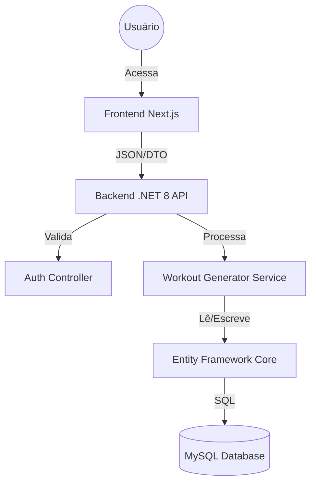

# 🏃 RunAnalitics

> **Plataforma SaaS de Treinamento Multiesporte Inteligente**

---

## 📖 Sobre o Projeto

O **RunAnalitics** é uma aplicação Fullstack projetada para democratizar o acesso a planos de treinamento personalizados. Utilizando um algoritmo de periodização linear, a plataforma gera treinos para **Corrida, Ciclismo, Natação e Triathlon** baseados no nível atual, disponibilidade de tempo e objetivo do atleta.

O projeto segue uma arquitetura moderna baseada em containers, separando claramente as responsabilidades entre Front-end e Back-end, garantindo escalabilidade e facilidade de manutenção.

---

## 🏗️ Arquitetura e Design

O projeto utiliza um padrão de **Monorepo** orquestrado via Docker Compose. A arquitetura segue os princípios **SOLID** e uma adaptação pragmática da **Clean Architecture** (Layered Architecture).

### Diagrama de Fluxo de Dados

Decisões Técnicas

🔙 Backend (.NET 8)

    Padrão Code-First: As tabelas do banco são geradas automaticamente a partir das classes C# (Models) via Migrations.

    DTOs (Data Transfer Objects): Camada de segurança que filtra os dados que entram e saem da API, desacoplando o banco da interface.

    Services Layer: Toda a regra de negócio (cálculo de pace, geração de calendário, validação de captcha) vive aqui, isolada dos Controllers.

    Segurança:

        JWT (Bearer Token): Autenticação stateless.

        BCrypt: Hash de senhas.

        Cloudflare Turnstile: Proteção anti-bot no registro.

⚛️ Frontend (Next.js 14)

    App Router: Utiliza a nova arquitetura de roteamento e layouts do Next.js.

    Context API: Gerenciamento de estado global para o fluxo complexo de cadastro (SignupFlow).

    Componentização: Design System próprio construído com Tailwind CSS (Paleta Zinc/Neutral).

    BFF (Backend for Frontend): O Dashboard consome endpoints agregados para performance, evitando cálculos pesados no cliente.

🚀 Como Rodar o Projeto

Pré-requisitos

    Docker Desktop (Instalado e rodando)

    Git

Passo a Passo

    Clone o repositório:
    Bash

git clone [https://github.com/SEU_USUARIO/run-analitics-app.git](https://github.com/SEU_USUARIO/run-analitics-app.git)
cd run-analitics-app

Suba os Containers: Este comando irá construir as imagens, criar a rede interna e subir o Banco, API e Frontend.
Bash

    docker-compose up --build

    Acesse a Aplicação:

        Frontend: http://localhost:3000

        Swagger (API Docs): http://localhost:8081/swagger

        Adminer (Banco): http://localhost:8082

📂 Estrutura do Projeto

/backend (API .NET 8)

    Controllers/: Pontos de entrada da API (ex: AuthController, WorkoutController). Apenas recebem requisições e devolvem respostas.

    Services/: O cérebro da aplicação. Onde vive a lógica de negócio (ex: WorkoutGeneratorService, TokenService).

    Models/: As entidades que representam as tabelas do banco (ex: User, TrainingLog).

    Dtos/: Contratos de dados para comunicação com o Frontend (ex: RegisterDto, DashboardSummaryDto).

    Data/: Configuração do Entity Framework (AppDbContext).

/frontend (Next.js)

    src/app/: Rotas da aplicação (/dashboard, /signup, /login).

    src/components/:

        ui/: Componentes básicos reutilizáveis (Botões, Inputs, Labels).

        dashboard/: Componentes específicos da área logada (Charts, Cards, Modais).

        signup/: Componentes do fluxo de cadastro.

    src/context/: Gerenciamento de estado global (SignupFlowContext).

    src/utils/: Funções auxiliares e adapters.

🔐 Autenticação e Segurança

O sistema utiliza um fluxo seguro de autenticação:

    Login: Usuário envia credenciais -> Backend valida Hash -> Backend gera JWT.

    Sessão: O Frontend armazena o JWT no localStorage.

    Requisições: Toda chamada à API privada envia o cabeçalho Authorization: Bearer <TOKEN>.

    Proteção: O Backend possui Middleware que rejeita requisições sem token válido (Erro 401).

🛠️ Comandos Úteis (Desenvolvimento)

Caso precise rodar comandos manuais (ex: criar migrations) sem reconstruir o Docker inteiro:

Criar uma nova Migration (no Backend):
Bash

cd backend
dotnet ef migrations add NomeDaMudanca

Reconstruir apenas o Backend (após mudanças de código C#):
Bash

docker-compose up -d --build backend

🧪 Links e Credenciais de Teste

Banco de Dados (Acesso via Adminer ou DBeaver):

    Server: db (se usar Adminer) ou localhost (se usar DBeaver)

    User: admin

    Password: adminpass

    Database: runanalitics_db

📝 Licença

Este projeto é desenvolvido para fins de aprendizado e portfólio.
